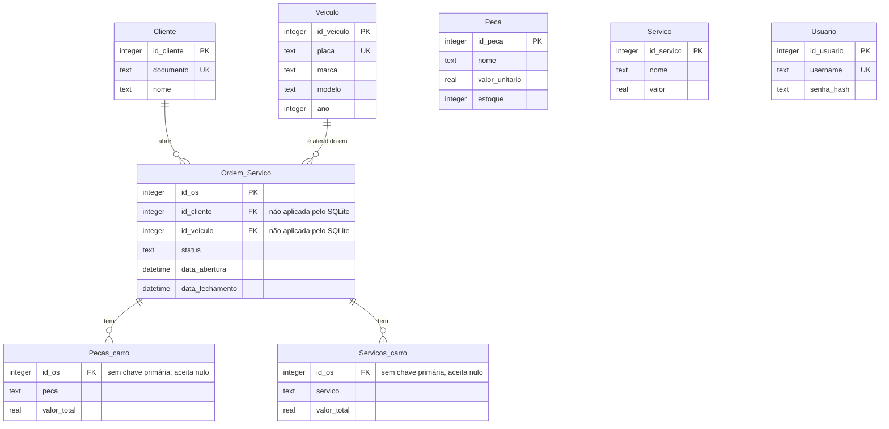
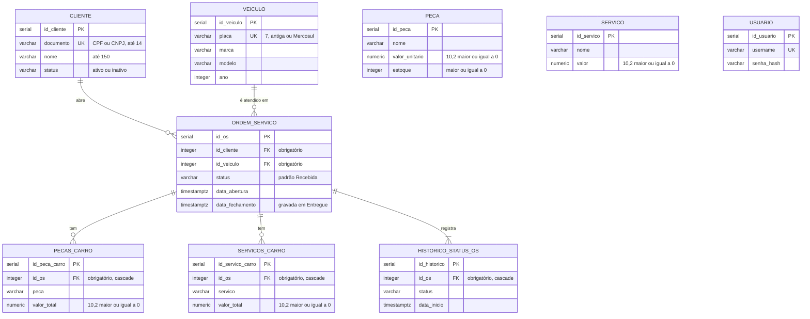

# Banco de dados: justificativa e modelo relacional

| Campo | Valor |
|---|---|
| Banco escolhido | PostgreSQL 16 no Amazon RDS |
| Repositório da infraestrutura | `fiap_tech_challenge_oficina_infra_database` |
| Criação das tabelas | Pela aplicação, na inicialização (`src/infrastructure.py` do repositório da API) |
| Registros relacionados | [RFC 002](rfcs/rfc_002_banco_de_dados.md), [ADR 008](adrs/adr_008_maquina_de_estados_da_os.md) |

## 1. Justificativa da escolha

O domínio da oficina é relacional por natureza. Uma ordem de serviço só existe ligada a um cliente e a um veículo, tem peças, serviços e um histórico de status que não fazem sentido sozinhos, e os relatórios pedidos cruzam essas informações. Por isso a escolha foi um banco relacional, e entre eles o PostgreSQL, pelos recursos listados abaixo, que são usados de fato no código.

| Necessidade do sistema | Recurso do PostgreSQL | Onde é usado |
|---|---|---|
| Uma OS nunca aponta para cliente ou veículo inexistente | Chaves estrangeiras aplicadas pelo banco | `ordem_servico`, itens e histórico |
| Documento, placa e usuário não se repetem | Restrições UNIQUE | `cliente.documento`, `veiculo.placa`, `usuario.username` |
| Valores monetários e estoque nunca negativos | CHECK e tipo `NUMERIC(10, 2)` | `peca`, `servico`, itens da OS |
| Abrir a OS com itens e histórico, tudo ou nada | Transações ACID | Abertura de OS e mudança de status |
| Duas alterações simultâneas não se sobrescrevem | Update condicional com isolamento transacional | Mudança de status ([ADR 008](adrs/adr_008_maquina_de_estados_da_os.md)) |
| Várias réplicas sobem ao mesmo tempo sem conflito na criação das tabelas | `pg_advisory_xact_lock` | Inicialização da aplicação |
| Tempo médio em cada status | Função de janela `LEAD` | Relatório `GET /api/os/tempo-medio` |
| Datas corretas entre fusos | `TIMESTAMPTZ` | Abertura, fechamento e histórico |
| Dev e prod no mesmo servidor, isolados | Schemas com `search_path` por conexão | Schema `dev` e schema `prod` |

O Amazon RDS acrescenta o que um banco gerenciado precisa oferecer:

* Backup automático e atualização automática de versão menor.
* Criptografia em repouso e acesso apenas pela rede privada da VPC, com security group liberando a porta 5432 só para o CIDR da VPC.
* Senha gerada pelo Terraform e guardada no SSM, sem passar por pessoas nem pelo repositório.
* Classe `db.t3.micro` elegível ao Free Tier.
* Mesma engine usada localmente no Docker Compose, o que garante que os testes rodam contra o mesmo banco da produção.

### Por que não manter o SQLite da Fase 2

* O arquivo ficava em um volume `ReadWriteOnce`, que só pode ser montado por um pod, o que impede o HPA de criar réplicas.
* Não suporta escrita concorrente de várias réplicas e da Lambda.
* As chaves estrangeiras não eram aplicadas, porque o SQLite só as aplica com `PRAGMA foreign_keys` ativado, e o código não ativava.
* O desafio exige banco gerenciado.

### Por que não um banco NoSQL

Um banco chave e valor como o DynamoDB não garante integridade referencial nem permite joins. As regras de negócio (cliente existente, veículo existente, itens sempre ligados a uma OS) e o relatório de tempo médio por status teriam que ser reimplementados na aplicação.

## 2. Modelo da Fase 2 (antes)

Problemas encontrados nesse modelo:

| Problema | Impacto |
|---|---|
| Chaves estrangeiras declaradas, mas não aplicadas | Era possível criar OS para cliente ou veículo inexistente e apagar um cliente com OS |
| `Pecas_carro` e `Servicos_carro` sem chave primária e com `id_os` aceitando nulo | Itens duplicados ou soltos, impossíveis de identificar individualmente |
| Valores em `REAL` | Ponto flutuante em dinheiro gera erros de arredondamento |
| Nenhuma restrição de valor | Aceitava preço e estoque negativos |
| Apenas o status atual da OS | Impossível medir o tempo gasto em cada etapa |
| Datas sem fuso horário | Ambiguidade entre servidores em regiões diferentes |
| Cliente sem status | A autenticação por CPF não teria como bloquear clientes inativos |
| Nenhum índice além das chaves primárias | Consultas por cliente, status e itens da OS varreriam a tabela inteira |
| Colunas adicionadas com `ALTER TABLE` dentro de `try` que ignorava erros | Falhas de migração passavam despercebidas |

## 3. Modelo atual (Fase 3)

### Ajustes feitos no modelo

| Ajuste | Motivo |
|---|---|
| Migração para PostgreSQL gerenciado | Concorrência, integridade aplicada e requisito de banco gerenciado |
| Chaves estrangeiras obrigatórias e aplicadas em `ordem_servico` | OS sempre ligada a cliente e veículo existentes |
| Chave primária própria em `pecas_carro` e `servicos_carro`, com `id_os` obrigatório | Cada item identificável, nenhum item solto |
| `ON DELETE CASCADE` nos itens e no histórico | Apagar uma OS remove tudo que pertence a ela |
| `NUMERIC(10, 2)` para valores | Precisão em dinheiro |
| CHECK de valores e estoque maiores ou iguais a zero | Consistência garantida pelo banco, mesmo fora da API |
| Coluna `status` no cliente, com CHECK `ativo` ou `inativo` | Base da autenticação por CPF |
| Tabela `historico_status_os` | Tempo em cada etapa e auditoria do fluxo |
| `TIMESTAMPTZ` nas datas | Datas sem ambiguidade de fuso |
| Índices nas chaves estrangeiras, no status e no histórico | Desempenho das consultas mais usadas |
| Nomes em minúsculas e tamanhos definidos nos textos | Padrão do PostgreSQL e limite de tamanho coerente com o domínio |
| Criação das tabelas idempotente e dentro de um advisory lock | Várias réplicas sobem juntas com segurança |
| Schema por ambiente | Isolamento entre dev e prod no mesmo servidor |

## 4. Relacionamentos

### Cliente e ordem de serviço (1 para N)

Um cliente pode ter várias ordens de serviço ao longo do tempo, e cada OS pertence a exatamente um cliente (`ordem_servico.id_cliente`, obrigatório). A exclusão de um cliente com OS é bloqueada pelo banco, e a API devolve 409. Para desativar um cliente sem perder o histórico, usa-se o `status` `inativo`, que também impede novos logins por CPF.

### Veículo e ordem de serviço (1 para N)

Um veículo pode passar por várias ordens de serviço, e cada OS é de exatamente um veículo (`ordem_servico.id_veiculo`, obrigatório). A exclusão de veículo com OS também é bloqueada.

### Cliente e veículo (N para N, pela ordem de serviço)

Não existe chave direta entre cliente e veículo. A ligação acontece pela OS: a mesma placa pode ser atendida para clientes diferentes ao longo do tempo, por exemplo depois de uma venda do carro, e o histórico de cada atendimento continua correto. Uma evolução possível é uma tabela de posse com período de validade.

### Ordem de serviço e itens (1 para N)

Uma OS tem zero ou mais peças (`pecas_carro`) e zero ou mais serviços (`servicos_carro`). Cada item pertence a uma única OS e é apagado junto com ela. O orçamento consolidado é a soma do `valor_total` dos itens.

### Ordem de serviço e histórico de status (1 para 1 ou mais)

Toda OS nasce com uma linha no histórico (status "Recebida") e ganha uma nova linha a cada mudança de status, na mesma transação da mudança. O tempo em cada etapa é a diferença entre o `data_inicio` de uma linha e o da seguinte da mesma OS.

### Catálogo de peças e serviços (sem relacionamento com os itens)

`peca` e `servico` formam o catálogo da oficina, com preço de referência e estoque. Os itens da OS guardam o nome e o valor cobrado naquele atendimento, sem chave para o catálogo. Assim o orçamento de uma OS antiga não muda quando o preço do catálogo muda. O estoque ainda não é baixado automaticamente quando uma peça entra na OS; ligar o item ao catálogo com baixa transacional é uma evolução planejada.

### Usuário (independente)

`usuario` guarda os funcionários que acessam as rotas administrativas, com a senha em hash. O usuário `admin` é criado na primeira inicialização de cada ambiente, com a senha gerada pelo Terraform.

## 5. Consistência

* As regras estruturais (existência, unicidade e valores válidos) ficam no banco, com chave estrangeira, UNIQUE e CHECK. As violações são traduzidas pela aplicação em mensagens claras, com status 400 ou 409.
* As regras de negócio do fluxo da OS ficam no domínio (`TRANSICOES`) e são aplicadas antes de qualquer gravação.
* A abertura da OS grava OS, itens e histórico em uma única transação.
* A mudança de status só grava se o status atual ainda for o que foi lido ([ADR 008](adrs/adr_008_maquina_de_estados_da_os.md)).

## 6. Desempenho

| Índice | Consulta que atende |
|---|---|
| `idx_ordem_servico_cliente` | "Minhas OS" do cliente autenticado e verificação da chave estrangeira ao excluir cliente |
| `idx_ordem_servico_veiculo` | Verificação da chave estrangeira ao excluir veículo |
| `idx_ordem_servico_status` | Consultas e agrupamentos por status |
| `idx_pecas_carro_os` e `idx_servicos_carro_os` | Carregar os itens de uma OS no orçamento e remover em cascata |
| `idx_historico_status_os` (`id_os`, `data_inicio`) | Histórico de uma OS em ordem e a função `LEAD` por OS no tempo médio |

Outras decisões de desempenho:

* Pool de conexões por processo (`ThreadedConnectionPool`), com tamanho máximo configurável em `DB_POOL_MAX`.
* A listagem de OS ativas já vem ordenada por prioridade de status (Em execução, Aguardando peças, Aprovado, Aguardando aprovação, Solicitado alterações, Em diagnóstico, Recebida) e depois pela data de abertura, direto do banco.
* Os gráficos do dashboard usam métricas enviadas ao Datadog, sem consultar o banco.

## 7. Segurança e dados pessoais

* O CPF é dado pessoal. Ele fica apenas na coluna `cliente.documento`, em banco criptografado e sem acesso público, e não é registrado nos logs da Lambda nem da API.
* A senha dos funcionários é guardada apenas como hash.
* As credenciais do banco ficam no SSM como SecureString.

## 8. Evoluções previstas

* Multi AZ para a instância de produção.
* Instâncias separadas para dev e prod quando houver orçamento.
* RDS Proxy para controlar as conexões quando o HPA escalar muito.
* Usuário de banco somente leitura para a Lambda.
* Migrações versionadas (Alembic ou Flyway) no lugar de `CREATE TABLE IF NOT EXISTS`.
* Tabela de posse entre cliente e veículo.
* Ligação dos itens da OS com o catálogo e baixa de estoque na mesma transação.
